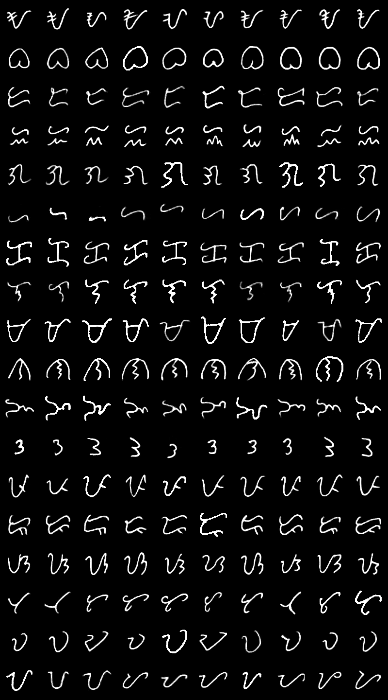

# Handwritten Baybayin Recognition

This repo contains the different scripts and notebooks used to conduct the thesis entitled "RECOGNITION OF MODERN BAYBAYIN (ANCIENT PHILIPPINE CHARACTER) LETTERS USING CONVOLUTIONAL NEURAL NETWORK" written by Ronnel Matthew Robles as part of the requirement for 4th year BS Computer Science in LPU-Laguna.

#### Dataset

You can find the dataset which are .npy files [here](https://huggingface.co/datasets/ronnelrobles/baybayin_characters).

## Authors

- [@mattdoesntstop](https://www.github.com/Ronnel-Matthew-Robles)

